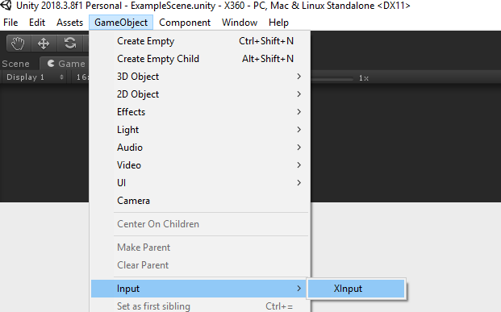
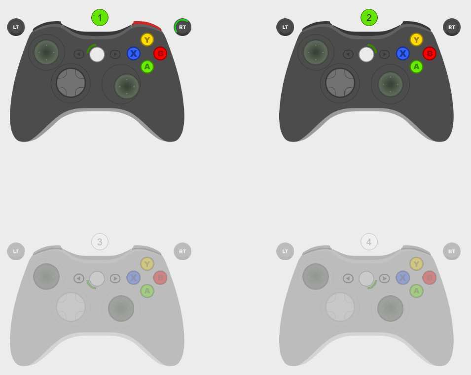

# XInput

You are using **Unity3D** and you wonder how to handle **Xbox 360** and **Xbox One** controllers very easily? Well, there you go!

**_XInput_** gets rid of all the complicated code so that you can focus on the essentials: interaction!

See [Examples](#examples) to find out what **_XInput_** is capable of.

## Getting Started

For a quick import into an existing project, just get the [UnityPackage](XInputPackage.unitypackage).

If you want to test the UnityPackage in an empty project, that's what the **_XInput_** folder is! :)

To get it working, just go into GameObject -> Input -> **_XInput_**. It will create a new GameObject in your scene, named "**_XInput_**" and with the **_XInput_** script on it. You're good to go!



## Examples

Here are some examples of what you can do with **_XInput_**:

<details>
<summary><strong>Controllers</strong></summary>
<br/>

<details>
<summary>Know if a controller is connected</summary>

```csharp
public class ExampleScript : MonoBehaviour
{
	void Update()
	{
		// Player 1 is connected
		if (XInput.IsControllerConnected())
		{

		}
	}
}
```
</details>

<details>
<summary>Know if a controller just connected</summary>

```csharp
public class ExampleScript : MonoBehaviour
{
	void Update()
	{
		// Player 1 just connected this frame
		if (XInput.ControllerConnected())
		{

		}
	}
}
```
</details>

<details>
<summary>Know if a controller just disconnected</summary>

```csharp
public class ExampleScript : MonoBehaviour
{
	void Update()
	{
		// Player 1 just disconnected this frame
		if (XInput.ControllerDisconnected())
		{

		}
	}
}
```
</details>

</details>

<details>
<summary><strong>Buttons</strong></summary>
<br/>

<details>
<summary>Know if a button is being hold</summary>

```csharp
public class ExampleScript : MonoBehaviour
{
	void Update()
	{
		// Player 1 is holding A
		if (XInput.ButtonHold(XInput.Button.A))
		{

		}
	}
}
```
</details>

<details>
<summary>Know if a button was pressed</summary>

```csharp
public class ExampleScript : MonoBehaviour
{
	void Update()
	{
		// Player 1 just pressed A this frame
		if (XInput.ButtonPressed(XInput.Button.A))
		{

		}
	}
}
```
</details>

<details>
<summary>Know if a button was released</summary>

```csharp
public class ExampleScript : MonoBehaviour
{
	void Update()
	{
		// Player 1 just released A this frame
		if (XInput.ButtonReleased(XInput.Button.A))
		{

		}
	}
}
```
</details>

</details>

<details>
<summary><strong>Sticks</strong></summary>
<br/>

<details>
<summary>Get the direction of a stick</summary>

```csharp
public class ExampleScript : MonoBehaviour
{
	void Update()
	{
		// Get the direction of Player 1 Left Stick as a Vector2
		Debug.Log(XInput.GetStickDirection(XInput.Stick.Left));
	}
}
```
</details>

<details>
<summary>Know if a stick's direction has changed</summary>

```csharp
public class ExampleScript : MonoBehaviour
{
	void Update()
	{
		// Player 1 just moved her Left Stick in the Up direction
		if (XInput.StickDirectionChanged(Stick.Left) == XInput.Direction.Up)
		{

		}
	}
}
```
</details>

<details>
<summary>Know if a stick was released</summary>

```csharp
public class ExampleScript : MonoBehaviour
{
	void Update()
	{
		// Player 1 just released her Left Stick
		if (XInput.StickReleased(XInput.Stick.Left))
		{

		}
	}
}
```
</details>

<details>
<summary>Know if a stick is in the deadzone</summary>

```csharp
public class ExampleScript : MonoBehaviour
{
	void Update()
	{
		// Player 1 has her Left Stick in the deadzone
		if (XInput.StickInDeadZone(Stick.Left))
		{

		}
	}
}
```
</details>

<details>
<summary>Set a new radius to use to determine whether a stick is in the deadzone</summary>

```csharp
public class ExampleScript : MonoBehaviour
{
	void Start()
	{
		// The new radius must be between [0-1]. If it's out of bounds, it will be clamped anyway.
		XInput.SetDeadZoneRadius(0.2f);
	}
}
```
</details>

</details>

<details>
<summary><strong>Triggers</strong></summary>
<br/>

<details>
<summary>Get the value of a trigger (between [0-1])</summary>

```csharp
public class ExampleScript : MonoBehaviour
{
	void Update()
	{
		// Get the Left Trigger value for Player 1
		Debug.Log(XInput.GetTriggerValue(XInput.Trigger.Left));
	}
}
```
</details>

<details>
<summary>Know if a trigger was pressed</summary>

```csharp
public class ExampleScript : MonoBehaviour
{
	void Update()
	{
		// Player 1 just pressed her Left Trigger this frame
		if (XInput.TriggerPressed(XInput.Trigger.Left))
		{

		}
	}
}
```
</details>

<details>
<summary>Know if a trigger was released</summary>

```csharp
public class ExampleScript : MonoBehaviour
{
	void Update()
	{
		// Player 1 just released her Left Trigger this frame
		if (XInput.TriggerReleased(XInput.Trigger.Left))
		{

		}
	}
}
```
</details>

<details>
<summary>Set a new value to use to determine whether a trigger was pressed or released</summary>

```csharp
public class ExampleScript : MonoBehaviour
{
	void Start()
	{
		// The new value must be between [0-1]. If it's out of bounds, it will be clamped anyway.
		XInput.SetTriggerMinValueToConsiderPressedOrReleased(0.9f);
	}
}
```
</details>

</details>

<details>
<summary><strong>DPad</strong></summary>
<br/>

<details>
<summary>Get the DPad direction</summary>

```csharp
public class ExampleScript : MonoBehaviour
{
	void Update()
	{
		// Player 1 is holding Up on her DPad
		if (XInput.GetDPadDirection() == XInput.Direction.Up)
		{

		}
	}
}
```
</details>

<details>
<summary>Know if the DPad direction has changed</summary>

```csharp
public class ExampleScript : MonoBehaviour
{
	void Update()
	{
		// Player 1 just moved her DPad in the Up direction
		if (XInput.DPadDirectionChanged() == XInput.Direction.Up)
		{

		}
	}
}
```
</details>

<details>
<summary>Know if the DPad was released</summary>

```csharp
public class ExampleScript : MonoBehaviour
{
	void Update()
	{
		// Player 1 just released her DPad
		if (XInput.DPadReleased())
		{

		}
	}
}
```
</details>

</details>

<details>
<summary><strong>Vibration</strong></summary>
<br/>

<details>
<summary>Set a vibration on both triggers</summary>

```csharp
public class ExampleScript : MonoBehaviour
{
	void Update()
	{
		if (somethingHappened)
		{
			// Set a vibration on Player 1 Left and Right Triggers, with power 50% for 1s
			XInput.SetVibration(0.5f, 1f);
		}
	}
}
```
</details>

<details>
<summary>Set a vibration on a specific trigger</summary>

```csharp
public class ExampleScript : MonoBehaviour
{
	void Update()
	{
		if (somethingHappened)
		{
			// Set a vibration on Player 1 Left Trigger, with power 50% for 1s
			XInput.SetVibration(XInput.Trigger.Left, 0.5f, 1f);
		}
	}
}
```
</details>

<details>
<summary>Stop the vibration for all controllers</summary>

```csharp
public class ExampleScript : MonoBehaviour
{
	void Update()
	{
		if (somethingHappened)
		{
			XInput.StopAllVibrations();
		}
	}
}
```
</details>

<details>
<summary>Stop the vibration for a specific controller</summary>

```csharp
public class ExampleScript : MonoBehaviour
{
	void Update()
	{
		if (somethingHappened)
		{
			// Stop vibration for Player 1.
			XInput.StopVibration();
		}
	}
}
```
</details>

<details>
<summary>Stop the vibration for a specific controller and specific trigger</summary>

```csharp
public class ExampleScript : MonoBehaviour
{
	void Update()
	{
		if (somethingHappened)
		{
			// Stop vibration for Player 1 Left Trigger.
			XInput.StopVibration(XInput.Trigger.Left);
		}
	}
}
```
</details>

</details>

## Best Code Usage

Actually, you can get information from the controllers in 2 ways :
- The first, simpler, is to call the methods directly. That's what the examples above show, for the sake of simplicity.

```csharp
public class ButtonScript : MonoBehaviour
{
	void Update()
	{
		if (XInput.ButtonPressed(XInput.Button.A)) // Player 1 just pressed A this frame
		{
			// Do stuff for player 1
		}
	}
}
```

- The second, hardly more complex and much more efficient and professional, consists of registering for events, and to perform actions only when these events occur.

```csharp
public class ButtonScript : MonoBehaviour
{
	void Start()
	{
		XInput.onButtonPressed += OnButtonPressed; // We listen to the OnButtonPressed event
	}

	void OnButtonPressed(XInput.Button button, int playerIndex)
	{
		if (button == XInput.Button.A && playerIndex == 0) // Player 1 just pressed A
		{
			// Do stuff
		}
	}

	void OnDestroy()
	{
		XInput.onButtonPressed -= OnButtonPressed; // We don't need to listen to the event anymore
	}
}
```

Here is the list of events you can register in this way:

<details>
<summary>Controller events</summary>
	
+ OnControllerConnected
+ OnControllerDisconnected

</details>

<details>
<summary>Button events</summary>
	
+ OnButtonPressed
+ OnButtonReleased

</details>

<details>
<summary>Stick events</summary>
	
+ OnStickDirectionChanged
+ OnStickReleased

</details>

<details>
<summary>Trigger events</summary>
	
+ OnTriggerPressed
+ OnTriggerReleased

</details>

<details>
<summary>DPad events</summary>
	
+ OnDPadDirectionChanged
+ OnDPadReleased

</details>

## Demo Scene

The screenshot below was taken from the Demo Scene, included in the plugin. You can plug in multiple controllers and see their model update when you press buttons!



## Notes

* Last tested with [Unity 2018.3.11f1](https://unity3d.com/unity/whats-new/2018.3.11), from 29 March 2019.
* **_XInput_** uses a radial method for its deadzone. See [this](http://www.third-helix.com/2013/04/12/doing-thumbstick-dead-zones-right.html) fantastic article to read more about the different deadzone methods.

## Authors

* **[Arthur Cousseau](https://www.linkedin.com/in/arthurcousseau/)**
* This plugin is "just" a wrapper around [XInputDotNet](https://github.com/speps/XInputDotNet). However, it does a lot more than that: it provides event-driven programming, and convenient enums.

## License

This project is licensed under the MIT License - see the [LICENSE.md](LICENSE.md) file for details.

## Acknowledgments

* Thanks to [360Controller](https://github.com/360Controller/360Controller), a macOS driver, for providing most of the images used in the demo scene.
